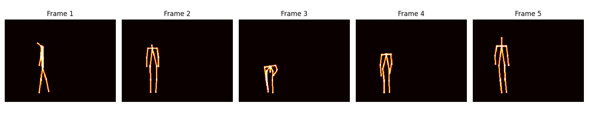
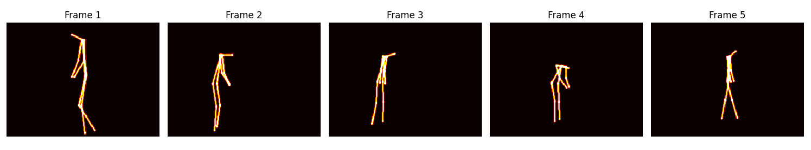
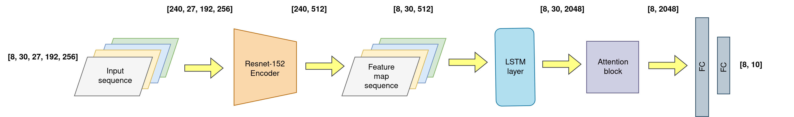
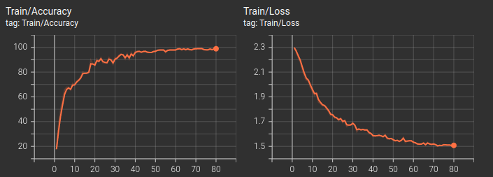

# Action Recognition

This repository hosts the implementation of various action recognition models, including 3DCNN, CNN+LSTM, and CNN+LSTM+Attention. The primary focus of this repository is the CNN+LSTM+Attention model, which utilizes data obtained from pose estimation tasks for activity recognition.

## Data Preparation

The data preparation process for training these models is based on the technique described in the paper ["Revisiting Skeleton-based Action Recognition"](https://arxiv.org/abs/2104.13586). This method involves generating heat maps for each joint and limb, which are then concatenated to form a comprehensive input array. This process captures the spatial relationships and dynamic movements inherent to each activity, allowing for a detailed representation of skeletal movements.

**Example Heat Maps Illustration:**
<!-- Placeholder for heat map image -->

*Heat maps showing detailed skeletal movements for two different activities.*

## Model Overview: CNN+LSTM+Attention

The CNN+LSTM+Attention model combines convolutional neural networks (CNNs) with long short-term memory (LSTM) units and includes an attention mechanism, creating a powerful framework for analyzing complex sequences.

### Encoder

The encoder is based on a modified ResNet-152, adapted to handle multi-channel input data. Originally designed for 3 RGB channels, our encoder processes 27 channels, effectively extracting spatial features from each frame of the sequence.

### LSTM Layer

The LSTM layer, with hidden dimensions of 1024, captures temporal dependencies between frames, essential for understanding the progression of actions within the sequence. Its capability to maintain a hidden state across frames enhances the model's predictive power.

### Attention Mechanism

An integrated attention layer prioritizes significant frames over others, focusing the model on more relevant segments of the sequence. This feature is crucial in complex scenes where specific actions or movements carry more informational weight.

### Output Layers

The sequence of features processed by the LSTM and weighted by the attention mechanism is directed through several linear layers, concluding with a softmax output. This final layer classifies the sequence into predefined categories based on the extracted features.

**Simplified Model Architecture Diagram:**
<!-- Placeholder for model architecture diagram -->

*Diagram of the CNN+LSTM+Attention model architecture.*

## Training Results

The model was trained over 80 epochs with a learning rate of 1e-5 using the AdamW optimizer. The cross-entropy loss function was employed. The training results revealed high accuracy, which may be attributed to the limited diversity of the dataset.

**Training Curves:**
<!-- Placeholder for training and testing curves -->

*Mean accuracy and loss curves for training phases.*

Thank you for exploring the Action Recognition repository. 

